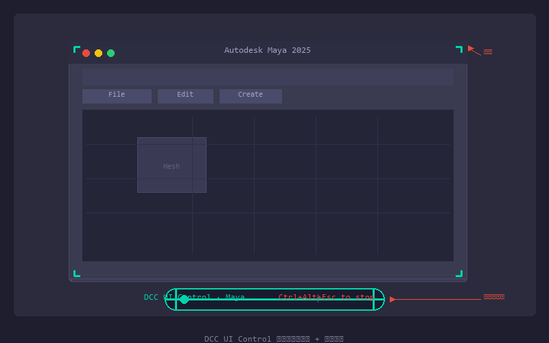
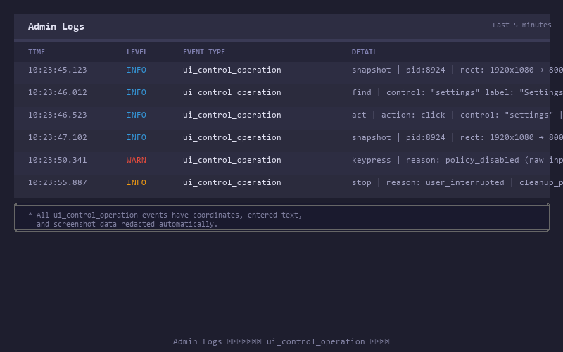

# dcc-mcp-core

[中文](README_zh.md) | English

**Rust-first control plane for connecting AI agents to live DCC sessions.**

dcc-mcp-core turns Maya, Blender, Houdini, Photoshop, Godot, RenderDoc, and
custom studio hosts into discoverable MCP and REST capabilities. It provides
the gateway, skills, structured results, main-thread dispatch, diagnostics,
IPC, workflows, and packaged CLI/server binaries needed to operate real
desktop sessions.

## Choose your entry point

| You want to… | Start with |
|---|---|
| Control a running DCC from an agent or CI job | [dcc-mcp-cli](docs/guide/cli-reference.md) |
| Expose a DCC adapter over MCP/REST | [create_skill_server](docs/guide/getting-started.md) |
| Add tools without Python registration code | [SKILL.md + tools.yaml](docs/guide/skills.md) |
| Build a new DCC adapter | [new-adapter-onboarding.md](docs/guide/new-adapter-onboarding.md) |
| Understand routing and multi-instance behavior | [gateway.md](docs/guide/gateway.md) |
| Integrate from any HTTP client | [rest-api-surface.md](docs/guide/rest-api-surface.md) |

## The current contract

The default agent path is CLI + REST:

~~~text
dcc-mcp-cli dcc-types (when adapter support is unclear)
  -> list
  -> search
  -> describe
  -> load-skill (only when needed)
  -> call
~~~

The gateway keeps tools/list bounded. It advertises the canonical
discovery/dispatch wrappers (search, describe, load_skill, and call) instead of
fanning every backend tool into one large list. Backend capabilities are
discovered by search, inspected by describe, and invoked through the wrapper or
the REST twin (POST /v1/search, /v1/describe, /v1/call).

When a concrete DCC session is needed, read gateway://instances; each entry
already includes its mcp_url. Do not use the removed legacy instance tools
(list_dcc_instances, get_dcc_instance, or connect_to_dcc). Wrapper inputs
belong inside arguments; do not put backend fields beside tool_slug.

For direct per-DCC MCP connections, the compatibility discovery names
(search_tools, describe_tool, and call_tool) remain available where the server
exposes them. New gateway integrations should use the canonical names above.

## Quick start: operate a DCC

`dcc-mcp-cli` is the preferred control path for every shell-capable agent.
If it is missing, obtain the user's consent before installing the latest
official release:

~~~bash
# Linux/macOS
curl -fsSL https://raw.githubusercontent.com/dcc-mcp/dcc-mcp-core/main/scripts/install-cli.sh | sh

# Windows PowerShell
powershell -ExecutionPolicy Bypass -c "irm https://raw.githubusercontent.com/dcc-mcp/dcc-mcp-core/main/scripts/install-cli.ps1 | iex"
~~~

Keep an official build current through the release manifest:

~~~bash
dcc-mcp-cli update check
dcc-mcp-cli update apply
~~~

`update apply` downloads and stages the latest CLI for the next launch. It does
not update a running `dcc-mcp-server`; update that server in its own environment.

Then discover a live capability before calling it:

~~~bash
dcc-mcp-cli dcc-types
dcc-mcp-cli list
dcc-mcp-cli search --query "create sphere" --dcc-type maya --limit 20
dcc-mcp-cli describe <tool-slug>
dcc-mcp-cli call <tool-slug> --json '{"radius": 2.0}' \
  --meta-json '{"agent_context":{"session_id":"task-42"}}'
~~~

`dcc-types` is an offline, catalog-backed capability query. It reports
canonical adapter identifiers and install-plan availability; `list` remains
the source of truth for live instances.

Replace the placeholder with the slug returned by search. For remote workstations,
register a gateway profile and select it:

~~~bash
dcc-mcp-cli gateway register https://workstation.example:19293 --name pcA
dcc-mcp-cli gateway set pcA
dcc-mcp-cli list
~~~

Use dcc-mcp-cli doctor when startup or readiness is unclear. Open the local
Admin UI at [http://127.0.0.1:9765/admin](http://127.0.0.1:9765/admin) after the
gateway is available.

After a task is accepted, agents can inspect bounded gateway evidence with
`dcc-mcp-cli stats --range 24h --session-id task-42`. A zero call count means
no telemetry evidence, and direct local calls may not be represented. Feed the
result plus short task and validation summaries to the
[`review_skill_improvement` prompt](skills/dcc-mcp-skills-creator/prompts.yaml).
The prompt defaults to no change, prefers improving an existing skill, and
never grants authority to edit or publish outside the task scope.

## Quick start: expose skills from Python

~~~bash
pip install dcc-mcp-core
~~~

Point the server at a skill directory and start the MCP endpoint:

~~~python
import os

from dcc_mcp_core import McpHttpConfig, create_skill_server

os.environ["DCC_MCP_MAYA_SKILL_PATHS"] = "/path/to/skills"

server = create_skill_server("maya", McpHttpConfig())
handle = server.start()
print(handle.mcp_url())
~~~

Local DCC instances bind an OS-assigned port by default. The resolved URL is
registered automatically, so the gateway and CLI discover it without a
hardcoded per-instance port. Pass `port=<number>` only for an explicit fixed
listener requirement.

For manual handler registration, use McpHttpServer and ToolRegistry. For
adapter lifecycle, readiness, gateway registration, and hot reload, use
DccServerBase as described in the adapter guides.

## Add a skill without framework glue

The project follows the agentskills.io frontmatter contract. Put dcc-mcp-core
extensions under metadata.dcc-mcp and keep tool declarations in a sibling file:

~~~text
my-skill/
├── SKILL.md
├── tools.yaml
└── scripts/
    └── do_thing.py
~~~

~~~yaml
# SKILL.md
---
name: my-skill
description: "Does a useful Maya task. Use when the user asks for it."
metadata:
  dcc-mcp:
    dcc: maya
    tools: tools.yaml
    search-hint: "geometry, scene task"
---
~~~

~~~yaml
# tools.yaml
tools:
  - name: do_thing
    description: Do the task in the active Maya scene.
    source_file: scripts/do_thing.py
    execution: sync
    affinity: main
    annotations:
      read_only_hint: false
      destructive_hint: true
~~~

Run the same production validator used by CI with
dcc-mcp-cli lint path/to/skills. See [Skills](docs/guide/skills.md) for schemas,
groups, dependencies, testing, and migration rules.

## DCC UI Control

Desktop application automation for cases where native DCC APIs cannot observe
or drive the interface state directly. Agents use `ui_control__snapshot`,
`ui_control__find`, `ui_control__act`, `ui_control__wait_for`, and
`ui_control__stop_computer_use` to observe, find, and act on target windows.

### Capabilities

- **Scoped window targeting** — snapshots and actions are bound to a single
  process or window handle, never the whole desktop.
- **Semantic UIA + raw input fallback** — prefer stable semantic controls
  (button, text field, checkbox) resolved by `ui_control__find`, then fall
  back to screenshot-relative coordinates when custom-drawn controls have no
  semantic node.
- **Bounded security model** — every action is scoped by the
  adapter/operator-bound PID/HWND. Raw input requires an explicit opt-in
  (`DCC_MCP_COMPUTER_USE_ALLOW_RAW_INPUT=true`). Hard-denied: passwords,
  authentication controls, LockApp, Windows Security, terminals, and
  credential manager windows.
- **Visible capsule overlay** — while a native DCC UI Control session is active,
  click-through corner brackets mark the target window and a bottom-center
  capsule reads `DCC UI Control · <app> | Esc to stop`.
  The user stops control at any time with `Esc`.
- **Audit trail** — every snapshot, action, wait, stop, and rejected operation
  appends a redacted `ui_control_operation` event to the shared log directory,
  visible in the Admin Logs panel without exposing entered text or screenshot
  coordinates.

### Tool reference

| Tool | Description |
|------|-------------|
| `ui_control__snapshot` | Capture a bounded PNG plus UIA tree from the scoped window |
| `ui_control__find` | Locate semantic controls by query, role, label, or object name |
| `ui_control__act` | Perform one scoped semantic or coordinate-based action |
| `ui_control__wait_for` | Poll until a UI condition becomes true or times out |
| `ui_control__stop_computer_use` | Release the capsule, hotkey, and global input owner |
| `ui_control__system_operation` | Ensure a named Windows configuration item (operator-granted) |

For detailed skill reference and agent workflows, see the
[ui-control skill](python/dcc_mcp_core/skills/ui-control/SKILL.md).

## Architecture

The runtime has four useful layers:

1. **DCC service** — owns skills and executes tools inside one DCC process.
2. **Sidecar/supervisor** — bridges host RPC, readiness, process lifetime, and
   gateway registration when an adapter uses the packaged runtime.
3. **Gateway daemon** — aggregates live instances and owns discovery, routing,
   REST, Admin UI, audit, and diagnostics.
4. **Client surfaces** — CLI, MCP clients, REST clients, and marketplace tools.

The Rust workspace and package membership are defined by the root
[Cargo.toml](Cargo.toml). The Python package is a PyO3 extension with pure
Python helpers and supports Python 3.7–3.14. Build-from-source requirements come
from [rust-toolchain.toml](rust-toolchain.toml) and package metadata; the
repository does not duplicate version or package counts in this README.

## Documentation map

- [Getting started](docs/guide/getting-started.md) — install the package and
  start a first server.
- [CLI reference](docs/guide/cli-reference.md) — complete operator commands and
  flags.
- [Gateway guide](docs/guide/gateway.md) — daemon, registry, routing, relay, and
  multi-instance behavior.
- [REST API surface](docs/guide/rest-api-surface.md) — request envelopes,
  tool_slug, readiness, and error contracts.
- [Skills guide](docs/guide/skills.md) — authoring, loading, validation, and
  persistence.
- [Adapter onboarding](docs/guide/new-adapter-onboarding.md) — the supported
  adapter implementation and release path.
- [Documentation index](docs/guide/INDEX.md) — the complete guide/API map.
- [AI agent guide](AI_AGENT_GUIDE.md) and [AGENTS.md](AGENTS.md) — agent workflow
  and repository rules.

## Development

Use the repository-pinned toolchain where possible:

~~~bash
vx just install
vx just dev
vx just test
vx just test-rust
vx just lint
vx just docs-check
~~~

docs-check builds the VitePress site and catches documentation links and syntax
errors. Markdown lint runs in the docs CI workflow. See
[CONTRIBUTING.md](CONTRIBUTING.md) for coding, testing, and release rules.

## License

MIT — see [LICENSE](LICENSE).
