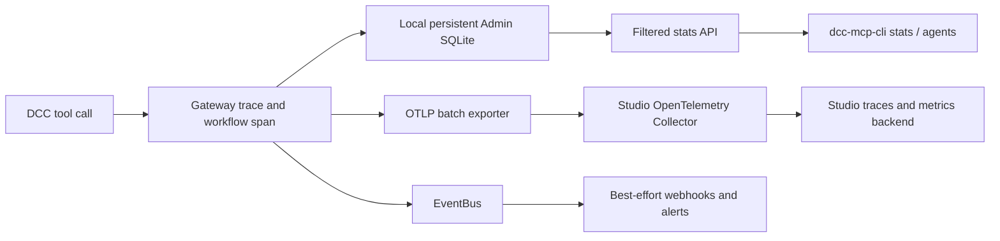

# ADR-013: Persist tool-call analytics locally and export studio telemetry through OTLP

## Status

Accepted

## Context

DCC-MCP already retains gateway dispatch traces and audits in SQLite, exposes
aggregate statistics in Admin, emits structured gateway workflow spans, and
supports EventBus webhooks. The former SQLite default was colocated with the
temporary FileRegistry, so an OS cleanup or registry reset could remove the
history needed to compare DCC, skill, tool, instance, session, outcome, and
latency over time.

Agents also need a stable machine interface instead of parsing terminal logs or
conversation transcripts. Studios need the same dimensions across many
workstations without sharing SQLite files or blocking DCC calls on a central
service.

The relevant non-functional requirements are:

- statistics collection must not block the tool-call hot path;
- local history must survive temporary-directory cleanup and gateway restarts;
- existing explicit database paths remain authoritative;
- agents receive stable JSON with composable filters;
- studio transport supports authentication, batching, and standard collectors;
- high-cardinality instance and session identifiers must not become unbounded
  metric labels;
- failures of a studio collector must not make a DCC tool call fail;
- captured arguments, outputs, actor data, and secrets must not be exported by
  default as aggregate statistics.

## Decision

### Local authority

Gateway Admin SQLite remains the workstation authority for retained traces and
audits. Its default path moves from the temporary FileRegistry to the
platform-local persistent DCC-MCP state directory resolved by
`dcc-mcp-paths`. `DCC_MCP_GATEWAY_ADMIN_DB` and an embedder-supplied explicit
path keep precedence. An explicit registry-directory hint is still honored for
embedders, but the normal gateway default no longer couples the two lifetimes.

The stable query contract is:

```text
GET /v1/debug/stats
  ?range=1h|24h|7d|all
  &dcc_type=<exact>
  &skill=<exact, hyphen/underscore equivalent>
  &tool=<full slug, backend slug, or terminal name>
  &status=success|failure
  &instance_id=<exact>
  &session_id=<exact>
```

All supplied dimensions are ANDed before aggregation. The response echoes the
canonical `filters` object. `dcc-mcp-cli stats` is a thin client for this API
and prints JSON by default. Existing unfiltered Stats and Admin requests keep
their behavior.

### Studio aggregation

OTLP is the primary studio-wide telemetry path. Existing gateway workflow spans
already carry `dcc_mcp.dcc.type`, `dcc_mcp.instance.id`,
`dcc_mcp.skill.name`, `dcc_mcp.tool.slug`, `dcc_mcp.session_id`, outcome, and
error attributes. The existing telemetry provider uses a batch exporter and
supports authenticated collector headers through
`OTEL_EXPORTER_OTLP_HEADERS`.

Deployments send OTLP to a local or studio OpenTelemetry Collector. The
collector owns TLS, authentication, retry/queue policy, privacy filtering,
sampling, and routing to the studio observability backend. Instance and session
dimensions remain trace attributes; low-cardinality DCC/tool/status dimensions
may be converted into metrics by the collector.

EventBus webhooks remain a complementary integration for alerts and low-volume
domain events. They support event filters, custom headers, timeouts, retries,
and a bounded queue, but the queue is in memory and drops new events when full.
Therefore webhooks are not an authoritative analytics transport and do not
replace OTLP or local SQLite.



## Consequences

### Positive

- workstation analytics survive `%TEMP%` cleanup;
- one filter model serves Admin, direct API clients, CLI, and agents;
- studios reuse the existing standard telemetry integration rather than a
  DCC-MCP-specific ingestion protocol;
- collector outages remain isolated from DCC execution;
- webhook alerting remains simple without being mistaken for durable storage.

### Negative

- existing databases under the old temporary default are not safe to copy
  automatically while another SQLite writer may own a WAL; operators that need
  old rows must stop the old gateway and migrate the database explicitly;
- OTLP batch buffers are not a durable zero-loss queue. Local SQLite remains the
  recovery source until a reviewed backfill/export contract is added;
- studio collectors must enforce retention and privacy policy.

### Neutral

- the default local retention remains 30 days and is controlled by
  `DCC_MCP_GATEWAY_ADMIN_RETENTION_DAYS`;
- explicit `DCC_MCP_GATEWAY_ADMIN_DB` deployments do not move;
- the FileRegistry remains temporary because its service-discovery lifetime is
  intentionally different from analytics history.

## Alternatives Considered

### Keep SQLite under the FileRegistry

Rejected because registry cleanup and analytics retention have different
lifecycles.

### Put one SQLite database on a studio network share

Rejected because SQLite locking and WAL semantics are not a multi-workstation
ingestion protocol and would couple DCC availability to shared storage.

### Use webhooks as the primary analytics feed

Rejected because the current webhook queue is in memory, delivery is per event,
and queue overflow intentionally drops events to protect tool execution.

### Add a proprietary studio ingestion API immediately

Rejected because OTLP already supplies authenticated batch transport and the
required gateway span dimensions. A future backfill API should be added only if
the studio requires a defined RPO that OTLP plus local retention cannot meet.

## References

- `docs/guide/observability.md`
- `docs/guide/events.md`
- `docs/rfcs/0002-event-bus-and-webhooks.md`
- `crates/dcc-mcp-gateway/src/gateway/agent_telemetry.rs`
- `crates/dcc-mcp-server/src/event_webhooks.rs`
