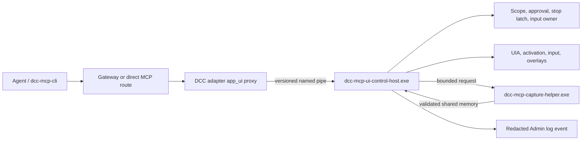

# ADR-014: Isolate DCC UI Control behind a native session host

## Status

Accepted; capture executable packaging superseded by [ADR-015](./015-bounded-ui-control-system-operations.md)

## Context

DCC UI Control currently combines a portable `app_ui` contract, Python skill
entry points, Windows UI Automation, native input, a visible stop overlay, and
a short-lived capture helper. This works inside adapters, but a non-DCC target
such as Epic Games Launcher needs a temporary operator process. Per-adapter
native state also makes global interruption, input ownership, approval, and
audit behavior harder to keep consistent.

The target capability level should match a mature Windows Computer Use system:
runtime-scoped window discovery, exact-window selection, bounded
screenshot and accessibility state, activation, click, scroll, drag, literal
text entry, key presses, value replacement, and secondary accessibility
actions. Capability parity does not mean bypassing action-time confirmation or
hard safety boundaries.

Application launch remains with the DCC launcher/adapter that already owns the
runtime process. UI Control never accepts an agent-supplied executable path;
its authority begins only after the runtime binds a PID or HWND.

The relevant non-functional requirements are:

- a hung `PrintWindow` call must never block a DCC, adapter, or UI Control host;
- native input must stay in the interactive Windows logon session that owns the
  selected DCC window;
- every mutation must target an opaque window object previously returned by
  discovery, never a guessed PID, HWND, title, or coordinate space;
- snapshot ids, accessibility indexes, and coordinates become invalid after
  every mutation, display change, target change, disconnect, or host restart;
- a valid but minimized exact target must expose state and a bounded recovery
  path without requiring the screenshot that minimization prevents;
- the user can stop every adapter's UI Control with one reserved hotkey;
- high-risk actions require a trusted host confirmation surface and fail
  closed when that surface is unavailable;
- typed text, screenshot pixels, coordinates, credentials, and selected text
  are redacted from audit logs by default;
- the runtime has no inbound network listener and does not require elevation;
- existing DCC adapters and Python 3.7 hosts keep the same `app_ui__*` MCP
  contract while migration is in progress.

## Decision

### Repository and release ownership

Keep the implementation in the `dcc-mcp-core` monorepo. Decoupling is provided
by a versioned local protocol and an operating-system process boundary, not by
an immediate repository split. Core continues to own compatible protocol
types, policy, packaging, Admin audit projection, and end-to-end tests.

Reconsider a separate repository only after the wire protocol reaches a stable
v1 and at least one of these conditions is true:

- two independent non-DCC products consume the host;
- a separate team owns its release and incident lifecycle;
- binary signing or installer cadence must diverge from `dcc-mcp-core`;
- compatibility support requires independent long-term protocol versions.

### Runtime boundary

Add a release-built `dcc-mcp-ui-control-host.exe`, with one instance per
interactive Windows logon session. It ships in Windows core/server wheels and
the server release bundle, whose package manifests cover its bytes; release
publishers may additionally apply Authenticode without changing the protocol.
It runs as the current user at the same integrity level as the target DCC and
exposes a current-user-only named pipe. The adapter verifies the pipe server's
PID and installed executable path, while the server verifies the caller's
Windows session, user SID, and integrity level. It has no TCP or HTTP listener.

Adapters keep the public `app_ui__snapshot`, `find`, `act`, `wait_for`, and
`stop_computer_use` tools, but become thin clients of the host. The host owns:

- application/window discovery and opaque window handles;
- target binding, focus checks, UIA state, and screenshot observation ids;
- session grants, action-time approval requests, and hard denies;
- the cross-adapter input lock and active-session Esc interruption latch;
- visible target overlays and cleanup of held keys/buttons;
- redacted `ui_control_operation` audit events for the existing Admin Logs
  panel.

The existing `dcc-mcp-capture-helper.exe` remains a separate short-lived child
used only for the synchronous `PrintWindow` call. The UI Control host owns the
deadline, kills and waits for a timed-out child, and validates the versioned
shared-memory response before accepting pixels. Screenshot isolation is not
merged into the long-lived host because a stuck window must remain killable.

### Permission model

The host supports the same broad capability surface as Codex Computer Use,
with four enforcement tiers:

1. **Allowed by an explicit task grant**: target discovery, observation,
   activation, navigation, and ordinary edits inside the named DCC/project.
2. **Pre-approval or action-time confirmation**: login/permission prompts,
   uploads, moves/renames, and transmission of specifically identified
   sensitive data to a specifically identified destination.
3. **Always confirm at action time**: deletion, overwrite of material user
   data, software installation or execution of newly downloaded software,
   financial actions, account/access changes, and communication or submission
   to third parties.
4. **Hard deny or hand-off**: terminals and the Windows Run dialog, password
   managers, authentication or credential dialogs, Windows security/privacy
   settings, safety-interstitial bypass, password changes, and any attempt to
   escape the selected process/window scope.

An explicit “full DCC control” grant enables raw pointer and keyboard actions
inside the selected DCC window for that task. It does not bypass tiers 3 or 4.
The native host itself is the trusted confirmation surface. If it cannot show
that surface, or the user declines, actions in tiers 2 and 3 fail closed with a
structured `approval_required` result.

### Protocol and lifecycle

The named-pipe protocol uses framed JSON requests plus shared-memory image
payloads and starts with a strict version/capability handshake. Every content
mutation carries:

- an opaque window capability returned by discovery;
- a UI Control session id and task grant id;
- the latest observation id or accessibility state id;
- an action descriptor with sensitive values separated from audit metadata.

The only pre-observation mutations are `restore`, `show`, and `activate` for
the already capability-bound HWND. `get_window_state` reports only
`exists/visible/minimized/foreground` plus the revalidated PID/HWND. These
requests carry the same session, grant, and opaque window capability; the host
rechecks HWND ownership and the hard target policy before changing state. They
cannot enumerate windows, accept a replacement target, or emit desktop input.
The initial exact-window notice covers them, every transition is audited, and
every transition invalidates prior observation fences.

The host validates the pipe ACL, caller identity, target process ownership,
window generation, desktop generation, integrity level, policy grant, and
approval immediately before input. A host crash or restart invalidates every
window capability and observation. Recovery requires discovery and a fresh
snapshot; input is never retried from stale state.

The protocol does not contain `confirmed`, `approved`, or equivalent client
booleans. The host starts a prominent non-modal notice for the initial
exact-window grant and confirms every tier 2/3 action. An optional `intent` is a lower-bound classification hint: the
host independently classifies UIA controls, pointed/focused controls, and
keyboard chords, and may only raise the tier. Agent-controlled arguments and
environment variables cannot resolve confirmation.

### Implemented vertical slice

- `dcc-mcp-app-ui::host_protocol` owns protocol v1, exact task scopes, opaque
  window capabilities, two observation fences, shared-image descriptors,
  action descriptors, permission tiers, and stable errors.
- `dcc-mcp-ui-control-host.exe` owns window resolution, `ComputerUseSession`,
  UIA snapshot/action children, the killable capture helper, shared-memory PNGs,
  visible overlays, input ownership, stop latch, trusted confirmation, and
  redacted audit.
- the Windows `app_ui` backend is a thin named-pipe proxy. Host absence,
  mismatch, UIA failure, or capture failure returns `backend_unavailable` or a
  more specific stable error; it never selects the former in-process path.
- every mutation atomically consumes both the native screenshot observation
  and accessibility-state id. Host restart, stop, mutation, desktop/display
  transition, target drift, or a fresh snapshot invalidates old state.
- `app_ui__act` exposes exact-window `get_window_state`, `restore_window`,
  `show_window`, and `activate_window` without a snapshot prerequisite. This
  breaks the minimized-window deadlock while retaining the confirmed
  capability-bound PID/HWND and without using pointer or keyboard input.
- raw input additionally requires the runtime ceiling
  `DCC_MCP_COMPUTER_USE_ALLOW_RAW_INPUT=true`; it does not alter confirmation
  or hard-deny policy.
- Windows wheel and server bundle checks require the host executable from the
  first release carrying this ADR.

Build and stage it with `vx just stage-ui-control-host`; use
`dcc-mcp-ui-control-host.exe --self-check` for a side-effect-free protocol
smoke test.

## Consequences

### Positive

- adapters no longer duplicate the most sensitive Windows session state;
- Epic Launcher and other adjacent apps no longer need a hand-maintained
  temporary Python operator;
- one global stop latch and input owner apply consistently across DCCs;
- capability parity can grow behind one versioned native API while public MCP
  tool names remain stable;
- a hung screenshot remains isolated and killable;
- Admin receives the same redacted operation stream for direct and
  gateway-routed calls.

### Negative

- packaging, signing, startup repair, named-pipe ACLs, and protocol compatibility
  become release-critical Windows responsibilities;
- one host per logon session is a larger blast radius than one process per
  adapter, so target capabilities and per-session grants must fail closed;
- Windows binary packaging and native confirmation UI are release-critical.

### Neutral

- `dcc-mcp-app-ui` remains the DCC-agnostic contract crate;
- `dcc-mcp-computer-use` remains the native Windows implementation linked into
  the isolated host binary;
- the existing MCP tool schemas and agent workflow remain compatible;
- non-Windows backends may adopt the same protocol later but are not required
  for the first implementation.

## Failure Modes and Mitigations

| Failure | Required behavior |
| --- | --- |
| Host missing or pipe unavailable | Return `backend_unavailable`; never fall back to another input path |
| Protocol mismatch | Reject during handshake and report both versions |
| Host crashes during input | Mark outcome unknown, invalidate state, require re-observation |
| Capture helper hangs | Kill and wait at deadline; return `capture_failed` or `timeout` |
| Desktop locks or disconnects | Suspend input, hide overlays, return `desktop_unavailable` |
| Exact target is minimized or hidden | Read exact-window state, then explicitly restore/show/activate the same capability-bound HWND before taking a fresh snapshot |
| User presses Esc while UI Control is active | Release held input, latch global stop, require explicit resume |
| Confirmation surface unavailable | Fail closed with `approval_required` |
| Target HWND/PID is reused | Reject stale capability and require discovery |
| Audit sink fails | Preserve action result, emit a local diagnostic, never log sensitive payloads |

## Alternatives Considered

### Keep all native UI Control state inside every adapter

Rejected as the target architecture because it duplicates global input,
interruption, approval, audit, and overlay ownership, and leaves adjacent apps
dependent on temporary operators.

### Move UI Control to a separate repository immediately

Rejected for now because the protocol, packaging, and policy are still moving
together. Separate repositories would add version skew before there is an
independent consumer or release owner.

### Put `PrintWindow` back in the long-lived host

Rejected because `PrintWindow` is synchronous and can hang indefinitely. A
killable child process is the isolation boundary that makes its deadline real.

### Grant unrestricted desktop input once per session

Rejected because process/window scope, stale observations, action-time
confirmation, and hard denies are part of the capability contract rather than
optional agent guidance.

## References

- `crates/dcc-mcp-app-ui`
- `crates/dcc-mcp-computer-use`
- `crates/dcc-mcp-capture/src/capture_worker.rs`
- `python/dcc_mcp_core/skills/app-ui`
- `docs/guide/app-ui-workflows.md`
