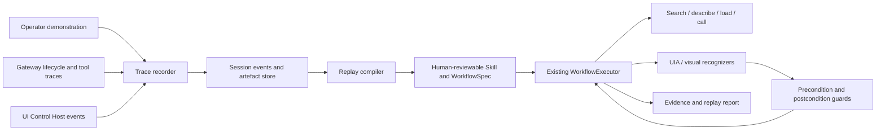

# ADR-017: Codex-style Record & Replay with visual closed-loop execution

## Status

Accepted

Baseline: `9d22daa2be09964a33890eabaa8d122011288875`

## Context

DCC-MCP needs a repeatable way to learn operator-demonstrated workflows while
preserving structured tools, exact-window safety, multi-session ownership, and
verifiable outcomes. Codex Record & Replay supplies the product model—turn a
focused demonstration into a reusable Skill. A review of existing visual
automation systems also confirms the value of separating capture, recognition,
task cancellation, calibration, and replay. Those systems are directional
evidence only, not implementation dependencies.

## Decision summary

Add a demonstration-to-Skill pipeline, not a general keyboard macro engine.
Recording captures structured DCC calls, scoped UI Control observations and
actions, user annotations, approvals, outcomes, and verification evidence.
A compiler converts that evidence into a parameterized `WorkflowSpec` plus a
small DCC-MCP Skill. Replay executes the workflow against the current runtime,
re-observing and validating after each mutation.

Use these established visual-automation patterns:

- explicit task lifecycle and cooperative cancellation;
- capture-provider separation from recognition and input;
- declarative visual recognizers with bounded search regions;
- DPI/window calibration for the rare coordinate fallback;
- visible runtime status and evidence artifacts.

Do not borrow blind timing replay, process elevation, game-specific behavior,
or unrestricted desktop input. The supported use cases are operator-authorized
DCC workflows, self-owned applications, offline game QA, and packaged-build
validation.

## Why this matches Codex Record & Replay

Codex Record & Replay observes a demonstration, drafts a reusable Skill with
inputs, steps, preferences, and verification, and later uses the tools
available in the new environment. It is not documented as deterministic raw
event playback. DCC-MCP should preserve that semantic model.

Source: <https://learn.chatgpt.com/docs/extend/record-and-replay>

## Requirements

### Functional

1. Start and stop a recording under an explicit task grant.
2. Record structured gateway calls and scoped UI Control actions in one ordered
   timeline with stable session, request, target, and artifact correlation.
3. Allow the demonstrator to mark variable inputs, hidden preferences,
   decision points, and success criteria.
4. Compile a recording into a reviewable Skill and `WorkflowSpec`.
5. Replay with new inputs using current tool discovery and schemas.
6. Prefer typed DCC tools, then semantic UIA, then visually anchored raw input.
7. Pause on drift, approval, desktop loss, user interruption, or ambiguity.
8. Produce a replay report with step evidence and final validation.

### Non-functional

- No secret, credential, raw prompt, or unrestricted desktop recording.
- Exact PID/HWND and Windows logon-session boundaries remain mandatory.
- Every mutation consumes its observation fence and requires re-observation.
- Approval is never recorded as reusable authority.
- Recording and replay are independently grantable and auditable.
- A replay must be cancellable while a capture, wait, or long DCC job runs.
- Artifacts are content-addressed and retention-bounded.
- Python 3.7 adapters remain thin clients; new orchestration stays in Rust/core.

## Architecture



## Reuse before adding code

| Need | Existing owner | Change |
| --- | --- | --- |
| Ordered execution, branches, approvals, retries, cancellation, resume | `dcc-mcp-workflow` | Extend only where observation assertions cannot be represented as tool steps |
| Session timeline | Gateway `sessions` and `session_events` tables | Add bounded record/replay event projections; do not add another database |
| Tool-call capture | Lifecycle hooks and gateway trace/audit records | Add a recorder sink keyed by trusted session namespace |
| Images and generated files | `dcc-mcp-artefact` / `FileRef` | Store hashes and references, not base64 in the workflow |
| UI observations and actions | Bundled `ui-control` Skill and isolated Host | Add record metadata; keep policy and execution in the Host |
| Regression replay | VRS | Use VRS for protocol regressions, not as the user-facing workflow format |
| Generated workflow package | `dcc-mcp-skills-creator` contracts | Generate minimal `SKILL.md`, `workflow.yaml`, optional recognition assets |

No new daemon, recorder service, generic event bus, or database is needed for
the first version.

## Recording model

Store an append-only, versioned timeline. Each event contains only bounded,
redacted metadata:

```yaml
recording_id: uuid
session_namespace: trusted-gateway-session
target:
  dcc_type: unity
  instance_id: uuid
  process_identity: redacted-stable-reference
events:
  - sequence: 1
    kind: tool_call
    tool_slug: unity.abcd.build_player
    arguments_template: {output: "${build_dir}"}
    schema_fingerprint: sha256
    result_summary: {success: true}
    evidence: ["artefact://sha256/..."]
  - sequence: 2
    kind: ui_semantic_action
    control_query: {role: button, label: Play}
    action: click
    precondition: {control_exists: true}
    postcondition: {window_title_matches: "*Game*"}
  - sequence: 3
    kind: assertion
    recognizer: {type: template, asset: "artefact://sha256/...", threshold: 0.92}
```

Do not store model reasoning, raw prompts, typed secrets, complete audit
payloads, raw window titles, global coordinates, or reusable confirmations.

## Compilation model

Compilation is a review step, not automatic execution.

1. Remove discovery chatter and failed exploratory calls unless they express a
   required fallback.
2. Prefer stable tool names and current schemas over captured transport slugs.
3. Replace demonstrated values with declared Skill inputs.
4. Infer preconditions and postconditions from observed state, then require the
   operator to approve them.
5. Convert stable calls to `WorkflowSpec` tool steps.
6. Convert UI actions to calls to existing `ui_control__*` tools.
7. Keep raw input only when no typed or semantic action represents the step.
8. Emit a drift report for unresolved targets, unstable labels, missing schema,
   or unverified outcomes instead of guessing.

Generated content remains small:

```text
recorded-workflow/
  SKILL.md
  workflows/replay.workflow.yaml
  workflows/replay.guard.json
  references/REPLAY_CONTRACT.md
  assets/recognition/       # optional, hash-addressed provenance only
```

## Replay modes

### 1. Structured replay — default

Re-discover the current tool, verify its schema fingerprint or a compatible
schema, then call it through the gateway. This is the fastest and most reliable
mode.

The compiler emits `replay.guard.json`; every CLI replay sends these guards to
`POST /v1/recordings/replay/validate` immediately before execution. Missing,
ambiguous, unloaded, or fingerprint-drifted tools stop the replay. This
validation does not grant replay authority.

### 2. Semantic UI replay — fallback

Take a fresh snapshot, resolve a control by role/label/value, execute one action,
and validate a semantic postcondition. Captured control ids are never reused.

### 3. Visual guarded replay — last resort

Resolve a visual anchor inside the exact target window, derive target-relative
coordinates, execute one observation-fenced action, and immediately validate.
Window size, DPI, display topology, theme, or recognition-confidence drift stops
the replay.

Never provide an unguarded raw timing mode. If exact timing is required for a
self-owned game test, use the engine's native test/input API instead of desktop
automation.

## Perception layer

Recognition is a small declarative contract, not a plugin framework:

```yaml
type: template | ocr | accessibility | image_difference
region: exact_window | normalized_rect | anchor_relative
asset: artefact://sha256/...   # template only
query: "Build succeeded"      # OCR/accessibility only
threshold: 0.92
timeout_ms: 5000
stable_frames: 2
```

Start with accessibility, template matching, OCR, and image difference using
already-installed/native capabilities. ONNX/YOLO remains an optional future
provider only after simpler recognizers measurably fail.

## Multi-session and scheduling rules

- A recording or replay has a trusted caller namespace plus a logical id.
- Different DCC instances may run structured-only steps concurrently.
- One exact target window executes one mutating UI step at a time.
- Native pointer/keyboard input remains globally single-owner per Windows logon
  session.
- Observation and recognition work may run concurrently only after the Host
  global mutex is split into map-level and per-session locks.
- Stop/cancel uses an atomic signal and must not wait for a long recording or
  another session's UIA call.
- Idle leases expire abandoned sessions, but never expire an in-flight step.

## Safety contract

1. Recording consent does not grant replay consent.
2. Replay authority cannot exceed the current operator grant.
3. Destructive and consequential steps confirm again on every replay.
4. `user_interrupted`, `desktop_unavailable`, policy denial, protected UI, or
   authentication UI stops the workflow; no backend switching or auto-resume.
5. A generated Skill is untrusted instruction-bearing content until reviewed.
6. Recognition output is evidence, never authority.
7. Replay never targets terminals, Run, UAC, credential surfaces, security
   settings, LockApp, or another process/window.
8. No anti-cheat evasion, memory injection, driver/HID spoofing, or live-service
   gameplay automation belongs in core.

## Failure handling

| Failure | Required result |
| --- | --- |
| Tool missing/schema drift | Pause with a describe/diff report; never substitute raw scripting automatically |
| Visual confidence below threshold | Pause and attach the latest bounded screenshot |
| Window/DPI/topology drift | Invalidate observations and recalibrate from a fresh exact-window snapshot |
| Approval required | Wait for current trusted confirmation; recorded approval is ignored |
| User stop | Release held input, mark interrupted, preserve completed step evidence |
| Host/adapter restart | Re-discover instance and target; resume only at an idempotent verified boundary |
| Partial cleanup | Enter `CleaningUp`; block new replay until cleanup succeeds |

## Delivery phases

### Phase 0 — prerequisites

- Fix caller-namespaced UI Control sessions.
- Split the Host global lock and make stop/cancel independent.
- Preserve `cleanup_pending` state until cleanup completes.
- Add session/audit correlation and idle leases.

### Phase 1 — structured demonstration compiler

- Project existing gateway lifecycle and `session_events` into a redacted
  recording manifest.
- Compile tool-only recordings to a reviewable `WorkflowSpec` and Skill.
- Reuse WorkflowExecutor approval, retry, idempotency, cancellation, and resume.
- Add one end-to-end mock adapter test.

### Phase 2 — semantic UI recording

- Record UI Control queries/actions and before/after semantic state.
- Compile semantic actions with fresh-snapshot guards.
- Reuse cached snapshot trees for `find` and accessibility-only observation for
  waits.

### Phase 3 — visual guarded fallback

- Add bounded template/OCR/image-difference recognizers.
- Add stable-frame and confidence policies.
- Add normalized target-relative calibration and drift rejection.

### Phase 4 — product surface

- Add explicit start/stop/review/compile/replay commands and Admin timeline.
- Publish generated Skills only after operator review; marketplace publication
  remains a separate authorization.

## Verification gates

Minimum automated coverage:

1. Two callers using logical `default` cannot see, stop, or replay each other's
   session.
2. A long recording in session A does not block cancel A or snapshot B.
3. Recorded approvals and secrets never appear in the manifest or generated
   Skill.
4. Tool-only replay survives compatible instance-id changes and rejects schema
   drift.
5. Semantic replay resolves a fresh control id and rejects a stale observation.
6. Visual replay rejects low confidence, changed DPI, moved/resized target, and
   another process's window.
7. `Esc`, disconnect, adapter death, and `cleanup_pending` release all input.
8. A VRS trace covers record -> compile -> replay -> evidence through gateway
   REST without a live DCC; live Windows/DCC validation is a separate gate.

Suggested commands after implementation:

```powershell
vx cargo test -p dcc-mcp-workflow
vx cargo test -p dcc-mcp-computer-use
vx pytest tests/test_ui_control_skill.py tests/test_e2e_gateway_prompts_sse.py
vx python scripts/vrs_replay.py --dry-run --base-url http://127.0.0.1:1 --trace tests/vrs/traces/<record-replay-trace>.jsonl
```

## Consequences

### Positive

- Demonstrated workflows become reviewable, parameterized Skills rather than
  opaque macros.
- Existing workflow, session, artifact, gateway, and UI Control ownership is
  reused.
- Replay can adapt to compatible runtime changes while still failing closed on
  ambiguous visual or policy state.

### Negative

- Compilation requires an explicit human review step.
- Visual fallback adds platform-specific recognition assets and calibration.
- True concurrent replay depends on fixing the current Host-wide mutex and
  session cleanup lifecycle first.

### Neutral

- Existing VRS traces remain protocol regression fixtures, not user recordings.
- Raw input remains a last-resort Host capability rather than a workflow-level
  authority.

## Alternatives rejected

- **Replay captured mouse/keyboard events verbatim**: fragile across layout,
  target, DPI, latency, and application state; bypasses available typed tools.
- **Let the model improvise every replay**: loses repeatability and auditability.
- **Create a separate recorder daemon**: existing lifecycle hooks, session
  events, workflow executor, Host, and artifact store already cover the needed
  ownership boundaries.
- **Import an external recorder/recognition implementation**: core already owns
  the required session, workflow, capture, policy, and artifact boundaries.
- **Add ONNX first**: template/OCR/accessibility cover the initial use cases with
  less packaging and runtime cost.

## Product defaults

1. The initial mutable surface is CLI/Gateway; Gateway Admin exposes a read-only
   recording/replay timeline until edit and approval UX is separately reviewed.
2. Generated Skills stay local by default. Team sharing requires explicit
   operator review; marketplace publication remains separately authorized.
3. Screenshots and transient visual evidence use the existing 24-hour artifact
   retention and size cap. Reviewed Skill sources follow normal Skill lifecycle;
   recording manifests use the existing Admin retention policy.
4. Visual execution ships on Windows first behind DCC-agnostic contracts so
   another platform can add a provider without changing workflow schemas.
