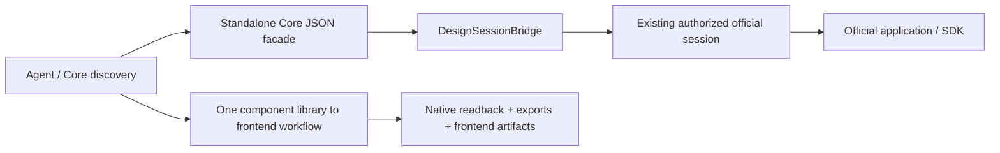

# Experimental official design provider bridge

This source trial adds five provider profiles and one session seam to Core
0.20.41. It is not a released adapter, install plan, or native acceptance
claim. The official application, MCP host, or API SDK retains canvas editing,
authentication, project permissions, and persistence ownership.

## Official capability and bridge matrix

Verified against first-party sources on 2026-10-04. Tool names below are
documentation examples; only a live session catalog establishes availability.

| Provider | Official read/write route | Device and account gates | Save/reopen and export boundary | Our increment |
| --- | --- | --- | --- | --- |
| Figma | Remote `use_figma` runs the Plugin API; context, variables, library search and asset tools support implementation | Remote OAuth and an eligible MCP Catalog client; general canvas writes require Full seat plus file edit permission. Desktop MCP requires the signed-in app and a Dev or Full seat on a paid plan | No general save/reopen tool established. Reopen and reread native IDs separately. `download_assets` supports images/vector/PDF; capture is a separate path | Inject an already authorized host session. The executable local trial supports desktop inspection only; it does not initiate remote OAuth |
| Penpot | Official MCP executes the Plugin API; `execute_code`, API context and shape exports | Connected file/plugin in an existing browser session; remote uses an existing MCP key. Active-tab/session behavior varies by deployed version | MCP PNG/SVG exports differ from native `.penpot` download. Remote excludes local paths. Save/reopen needs explicit file/session readback | Preserve the observed schema and session targeting; avoid hard-coding development-only multi-session support |
| Pencil / pen.dev | Official stdio MCP uses the native editing engine; a headless CLI also exists | Open `.pen` document for desktop/IDE MCP; authenticated headless CLI, Node >=22.19. No binary path is guessed | Official CLI can save native files and export image/PDF/HTML routes. Validate real outputs: an export failure can still return exit code zero | Accept the existing official stdio client entry; preserve `read_skill` and live editing tools |
| Sketch | Built-in local MCP; `run_code` uses the Sketch API | Mac app >=2025.2.4, non-App-Store build, valid existing license; user enables MCP and handles any system permission | API save/open callbacks and native `.sketch` readback; image/vector/PDF/JSON export is distinct from frontend generation | Local Mac trial only. Windows execution returns `unsupported_host`; no simulated Mac acceptance |
| Framer | Official External Agent bridge and `framer-api` Server API; these are distinct from a fixed official MCP endpoint | Existing project grant for the agent bridge, or existing project-bound SDK key supplied by its owner | Disconnect/reconnect and reread the project. Publishing is not source export. A full frontend bundle export was not established | Explicit API facade over the SDK; advertise only methods present in that SDK. This trial omits publishing and deployment |

Sources: [Figma write](https://developers.figma.com/docs/figma-mcp-server/write-to-canvas/),
[client eligibility](https://developers.figma.com/docs/figma-mcp-server/remote-server-installation/),
[tool catalog](https://developers.figma.com/docs/figma-mcp-server/tools-and-prompts/),
[Penpot MCP](https://help.penpot.app/mcp/),
[Pencil AI integration](https://docs.pencil.dev/core-concepts/ai-agents),
[Pencil CLI](https://docs.pencil.dev/for-developers/pen-cli),
[Sketch MCP](https://www.sketch.com/docs/mcp-server/),
[Framer External Agents](https://www.framer.com/agents/external/),
[Framer Server API](https://www.framer.com/developers/server-api-introduction).

Licensing and costs are separate gates. Penpot's official source is MPL-2.0.
Pencil has a proprietary EULA and its pricing page describes future plans;
do not redistribute its binaries. Sketch requires an existing usable license.
Figma seat and rate limits depend on the current plan. Framer's Server API FAQ
describes beta access with future pricing unresolved. The trial does not create
accounts, buy plans/seats, generate keys, initiate OAuth/project grants, or
change device/network permissions.
[Penpot source license](https://github.com/penpot/penpot/blob/develop/LICENSE),
[Pencil EULA](https://www.pen.dev/eula), [Pencil pricing](https://www.pen.dev/pricing),
[Sketch pricing](https://www.sketch.com/pricing/),
[Figma access/limits](https://developers.figma.com/docs/figma-mcp-server/rate-limits-access/),
[Figma desktop access](https://help.figma.com/hc/en-us/articles/32132100833559-Guide-to-the-Figma-MCP-server),
[Framer API FAQ](https://www.framer.com/developers/server-api-faq).

## Architecture

`dcc_mcp_core.design_bridge.DesignSessionBridge` is pure Python with no SDK
dependency or native-extension import. It accepts a caller-owned async session
with `list_tools(cursor=...)` and `call_tool(name, arguments=...)`. Framer
requires an explicit `FramerApiFacade` so an SDK is never mislabeled as official
MCP. Pagination is bounded and fails instead of publishing a partial catalog.
The bridge preserves names, schemas, annotations, metadata, and full result
mappings. SDK models are serialized using their wire aliases.

Connect, catalog refresh and disconnect advance the discovery generation.
Callers pass that generation with a tool name; stale sessions and tools absent
from discovery fail before dispatch. Calls are never automatically retried or
replayed. The owner closes the SDK/transport; disconnecting the bridge does
not invent cancellation of an upstream edit.

Status reports connection and catalog facts; authentication, document binding,
and native acceptance remain unknown/unverified until independently checked.
Errors have fixed public codes: `auth_required`, `permission_denied`,
`unsupported_host`, `unavailable`, `upstream_error`. Exception messages,
credential URLs, project payloads and private diagnostics are not public
validation evidence. An uncertain dispatched call reports an indeterminate
effect requiring readback.

The optional [runnable trial](https://github.com/dcc-mcp/dcc-mcp-core/blob/main/examples/design-provider-bridge/README.md)
uses the official maintained MCP Python SDK for local transports and the
official Framer SDK for project access. It owns one long-lived event loop and
session. Its Core facade registers through existing Core helpers before
starting a loopback service. A temporary trial registry is the default;
operators may select an already authorized registry explicitly. It does not
launch or restart a production gateway.

## Fidelity boundary

Core 0.20.41 Python JSON handlers wrap returned mappings in Core content and
`structuredContent`. The trial therefore retains the official response under
`context.upstream_result`; outer MCP image/resource/audio blocks are not
promised to be byte-identical. Native tool annotations remain visible in
`capabilities`/`describe`; the generic facade omits explicit annotations and
uses MCP's conservative defaults, with its call described as potentially
mutating. No Rust registry/transport change is required for this
phase. A future direct native wire mode needs explicit annotation/content and
REST conformance work.

A received response is transport evidence only. `isError` is honored; plain
text remains unverified because an upstream server can encode business errors
in text. Native success requires structural readback, saved/reopened IDs and
validated exports. Contract fixtures prove bridge behavior, never vendor
read/write availability.

## One reusable workflow

The shared [pilot](https://github.com/dcc-mcp/dcc-mcp-core/blob/main/examples/design-provider-bridge/pilot/README.md) uses
editable tokens, components, a page specification, and a runnable frontend.
Its local build checks and candidate native asset validation are distinct
from the five providers' pending native phases. The corresponding conditional
workflow guidance is maintained by `dcc-mcp-agent-plugins`; this Core trial
does not duplicate the public router skill.

1. Inventory an authorized host and inspect exact current tools/schema.
2. Read the selected library, tokens, components and target project/document.
3. Reuse native component instances and token bindings in one isolated page.
   Check the exact live document/page/project immediately before every edit;
   for focus-based Penpot sessions, assert identity inside the same official
   script before modifying anything. A connection ID does not freeze focus.
4. Read back structure, save/reopen/reconnect, then reread native identifiers.
5. Validate actual exported files; generate and check reusable frontend code.
6. Retain private evidence locally and produce a reviewed public-safe manifest.

Each stage has its own evidence and status. One completed workflow may join
the existing Showcase/Marketplace plan after native acceptance and review;
five provider profiles do not create five new sets of showcases. No software
release or Marketplace publication is part of this source trial.

All five native branches remain unrun. The [native acceptance checklist](https://github.com/dcc-mcp/dcc-mcp-core/blob/main/examples/design-provider-bridge/NATIVE_ACCEPTANCE.md)
records the scoped local observations, exact existing objects needed and each
provider's real read/write/reopen/export sequence.
